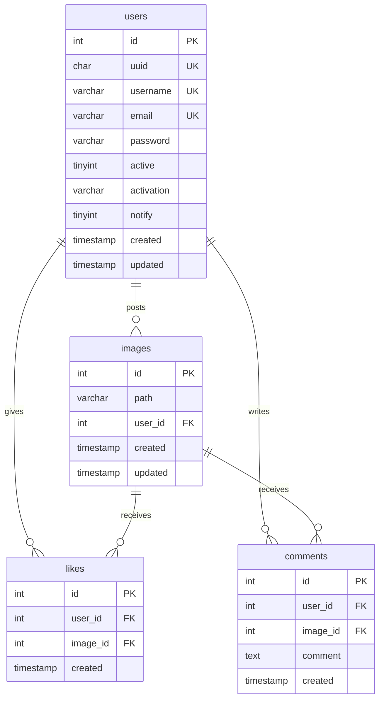

# Modelagem do Banco de Dados (Database Schema)

Este documento descreve a modelagem e estrutura do banco de dados do projeto **Camagru**, utilizando MariaDB. Todas as tabelas, campos e relacionamentos seguem o padrão em inglês e com nomes de campos simplificados.

---

## Estrutura Geral das Tabelas

A modelagem é composta por 4 tabelas principais:
1. `users`: Armazena informações dos usuários cadastrados, estado de ativação de conta e preferências de notificação.
2. `images`: Armazena as fotos criadas pelos usuários na plataforma (caminho do arquivo e autoria).
3. `likes`: Relaciona os usuários e as imagens curtidas de forma única.
4. `comments`: Relaciona os comentários efetuados pelos usuários nas imagens.

---

## Detalhamento das Tabelas

### 1. Tabela: `users`
Guarda as credenciais de acesso, controle de ativação da conta e consentimento de notificação.

| Campo | Tipo | Restrições / Padrão | Descrição |
| :--- | :--- | :--- | :--- |
| `id` | `INT UNSIGNED` | `PRIMARY KEY`, `AUTO_INCREMENT` | Identificador interno único numérico. |
| `uuid` | `CHAR(36)` | `NOT NULL`, `UNIQUE` | Identificador público único universal (UUID v4). |
| `username` | `VARCHAR(50)` | `NOT NULL`, `UNIQUE` | Nome de usuário único na plataforma. |
| `email` | `VARCHAR(100)` | `NOT NULL`, `UNIQUE` | E-mail do usuário (utilizado para login e notificações). |
| `password` | `VARCHAR(255)` | `NOT NULL` | Hash seguro da senha do usuário (ex: gerada com `password_hash()`). |
| `active` | `TINYINT(1)` | `NOT NULL`, `DEFAULT 0` | `1` se a conta estiver ativa/verificada por e-mail, `0` caso contrário. |
| `activation` | `VARCHAR(255)` | `NULL` | Código/token gerado para ativação ou redefinição de conta via e-mail. |
| `notify` | `TINYINT(1)` | `NOT NULL`, `DEFAULT 1` | `1` se o usuário deseja receber alertas por e-mail, `0` caso contrário. |
| `created` | `TIMESTAMP` | `DEFAULT CURRENT_TIMESTAMP` | Data/hora de cadastro do usuário. |
| `updated` | `TIMESTAMP` | `DEFAULT CURRENT_TIMESTAMP ON UPDATE CURRENT_TIMESTAMP` | Data/hora da última alteração no perfil. |

---

### 2. Tabela: `images`
Armazena a publicação das montagens criadas na aplicação.

| Campo | Tipo | Restrições / Padrão | Descrição |
| :--- | :--- | :--- | :--- |
| `id` | `INT UNSIGNED` | `PRIMARY KEY`, `AUTO_INCREMENT` | Identificador único da imagem. |
| `path` | `VARCHAR(255)` | `NOT NULL` | Caminho relativo do arquivo de imagem no servidor web. |
| `user_id` | `INT UNSIGNED` | `NOT NULL`, `FOREIGN KEY` | Referência ao autor da imagem (`users.id`). |
| `created` | `TIMESTAMP` | `DEFAULT CURRENT_TIMESTAMP` | Data/hora da criação/postagem da foto. |
| `updated` | `TIMESTAMP` | `DEFAULT CURRENT_TIMESTAMP ON UPDATE CURRENT_TIMESTAMP` | Data/hora da última modificação da foto. |

* **Comportamento de Integridade**: `FOREIGN KEY (user_id) REFERENCES users(id) ON DELETE CASCADE`
  *(Se um usuário for excluído, todas as suas imagens serão apagadas automaticamente).*

---

### 3. Tabela: `likes`
Registra as curtidas associadas às fotos.

| Campo | Tipo | Restrições / Padrão | Descrição |
| :--- | :--- | :--- | :--- |
| `id` | `INT UNSIGNED` | `PRIMARY KEY`, `AUTO_INCREMENT` | Identificador único da curtida. |
| `user_id` | `INT UNSIGNED` | `NOT NULL`, `FOREIGN KEY` | Referência ao usuário que curtiu (`users.id`). |
| `image_id` | `INT UNSIGNED` | `NOT NULL`, `FOREIGN KEY` | Referência à imagem curtida (`images.id`). |
| `created` | `TIMESTAMP` | `DEFAULT CURRENT_TIMESTAMP` | Data/hora em que a curtida foi dada. |

* **Chave Única Combinada**: `UNIQUE KEY unique_user_image (user_id, image_id)`
  *(Garante que o mesmo usuário não possa curtir a mesma imagem mais de uma vez).*
* **Comportamento de Integridade**:
  - `FOREIGN KEY (user_id) REFERENCES users(id) ON DELETE CASCADE`
  - `FOREIGN KEY (image_id) REFERENCES images(id) ON DELETE CASCADE`

---

### 4. Tabela: `comments`
Armazena os comentários inseridos nas imagens publicadas.

| Campo | Tipo | Restrições / Padrão | Descrição |
| :--- | :--- | :--- | :--- |
| `id` | `INT UNSIGNED` | `PRIMARY KEY`, `AUTO_INCREMENT` | Identificador único do comentário. |
| `user_id` | `INT UNSIGNED` | `NOT NULL`, `FOREIGN KEY` | Referência ao usuário que comentou (`users.id`). |
| `image_id` | `INT UNSIGNED` | `NOT NULL`, `FOREIGN KEY` | Referência à imagem onde o comentário foi feito (`images.id`). |
| `comment` | `TEXT` | `NOT NULL` | Conteúdo em texto do comentário. |
| `created` | `TIMESTAMP` | `DEFAULT CURRENT_TIMESTAMP` | Data/hora do comentário. |

* **Comportamento de Integridade**:
  - `FOREIGN KEY (user_id) REFERENCES users(id) ON DELETE CASCADE`
  - `FOREIGN KEY (image_id) REFERENCES images(id) ON DELETE CASCADE`

---

## Migração Automática no Startup

A inicialização desta estrutura ocorre automaticamente pela classe core [`Database.php`](file:///e:/42%20rio/Camagru/src/Core/Database.php) quando a aplicação se conecta ao banco de dados pela primeira vez. 

O fluxo executado é:
1. Conecta ao servidor MariaDB.
2. Consulta o `information_schema.tables` para checar se a tabela `users` já existe no banco de dados ativo.
3. Se não existir, lê o arquivo [`setup.sql`](file:///e:/42%20rio/Camagru/src/config/setup.sql) e executa o DDL de criação de todas as tabelas.
4. Isso previne logs de erro desnecessários nos consoles e permite que novos ambientes subam sem a necessidade de comandos manuais.
