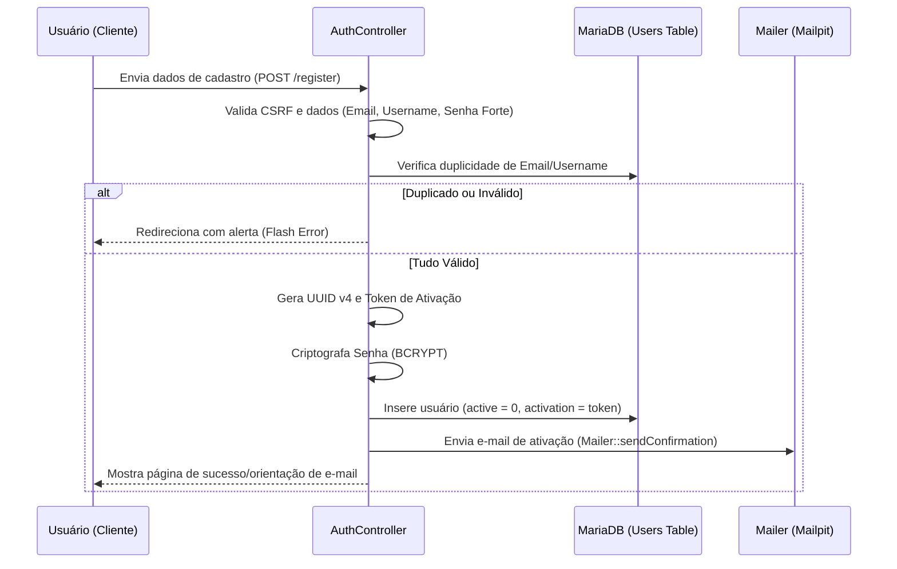
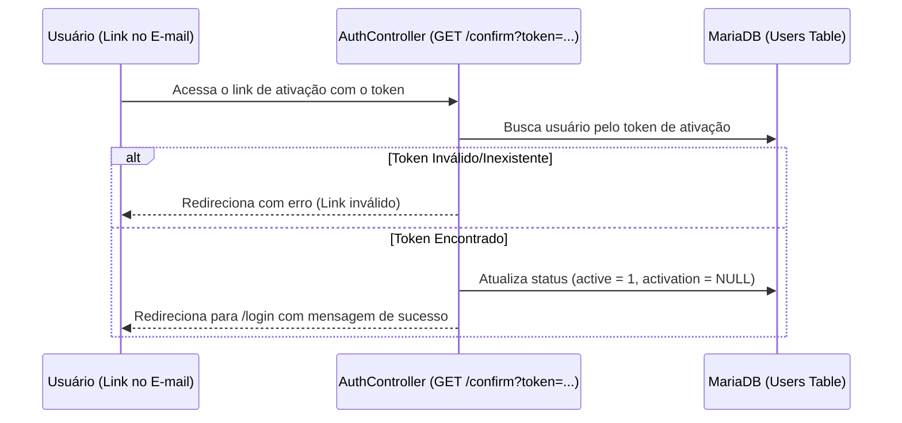
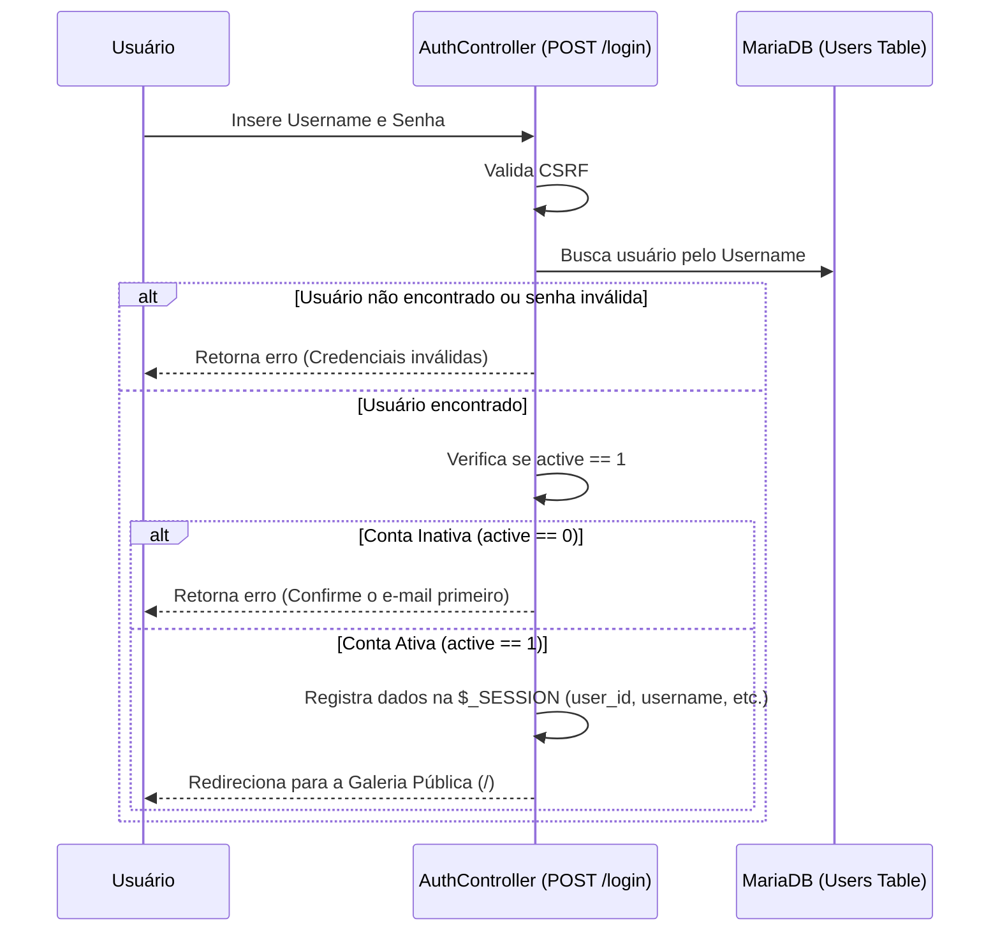
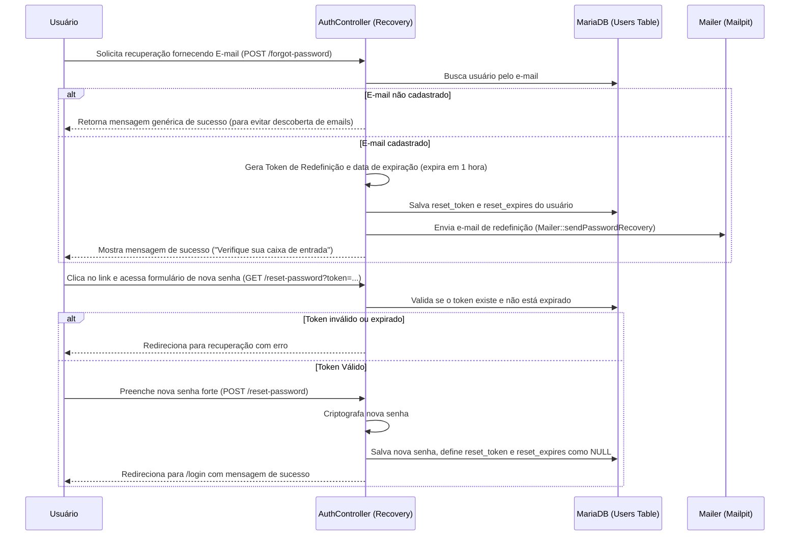

# 06 - Autenticação, Proteção CSRF e Fluxos de Segurança

Este documento explica de forma detalhada o funcionamento da proteção contra CSRF (Cross-Site Request Forgery), a validação de formulários e os fluxos completos de registro, login, ativação de conta e redefinição de senha da plataforma Camagru.

---

## 1. Proteção contra CSRF (Cross-Site Request Forgery)

A proteção contra ataques CSRF garante que as requisições que alteram dados no servidor (do tipo `POST`, `PUT`, `DELETE`) sejam enviadas de fato de forma legítima a partir da interface oficial da aplicação, e não por scripts maliciosos externos.

### Geração do Token CSRF
O token CSRF é gerado de forma pseudo-aleatória criptograficamente segura e armazenado na sessão do usuário no momento da inicialização da aplicação.
Esta verificação/inicialização ocorre globalmente no arquivo [index.php](file:///e:/42%20rio/Camagru/src/index.php):

```php
// Inicializa o token CSRF na sessão caso ainda não exista
if (empty($_SESSION['csrf_token'])) {
    $_SESSION['csrf_token'] = bin2hex(random_bytes(32));
}
```

Qualquer formulário HTML na aplicação deve conter um campo oculto contendo esse valor:

```html
<input type="hidden" name="csrf_token" value="<?= $_SESSION['csrf_token'] ?>">
```

### Validação do Token CSRF
Durante a submissão de requisições que alteram estado (por exemplo, no envio do formulário de login ou registro), o controlador correspondente obtém o token enviado pelo formulário e o compara com o token salvo na sessão do servidor.
A comparação deve utilizar uma função resistente a ataques de tempo (timing attacks), como `hash_equals()` do PHP:

```php
protected function validateCsrfToken($token) {
    if (empty($_SESSION['csrf_token']) || empty($token)) {
        return false;
    }
    return hash_equals($_SESSION['csrf_token'], $token);
}
```

Se os tokens não coincidirem, a requisição é rejeitada imediatamente com um erro HTTP 403 (Proibido) ou redirecionada exibindo um alerta de segurança.

---

## 2. Fluxo Completo de Registro

O processo de criação de uma nova conta exige a confirmação do endereço de e-mail para evitar contas falsas e abusos.



### Regras de Validação de Registro:
1. **Nome de usuário (Username)**: Deve conter entre 3 e 20 caracteres, sendo permitido apenas letras, números e underline (`_`).
2. **E-mail**: Deve possuir formato de e-mail válido (`FILTER_VALIDATE_EMAIL`).
3. **Senha (Password)**: Deve possuir pelo menos 8 caracteres e conter pelo menos uma letra maiúscula, uma letra minúscula, um número e um caractere especial para garantir segurança máxima contra força bruta.
4. **Verificação de duplicidade**: Consultas diretas no banco de dados para checar se o username ou e-mail já foram registrados por outro usuário.

---

## 3. Fluxo de Confirmação de E-mail (Ativação)

Com o e-mail de ativação enviado, a conta permanece inativa até que o usuário clique no link exclusivo enviado para sua caixa de entrada.



---

## 4. Fluxo Completo de Login

O login autentica o usuário garantindo que ele preencheu as credenciais corretas e que a conta está ativada.



### Chaves Armazenadas na Sessão:
- `$_SESSION['user_id']`: ID único do usuário do banco de dados (usado para relacionar Likes, Comentários e Fotos).
- `$_SESSION['username']`: Nome de exibição nas páginas e layouts.
- `$_SESSION['user']`: Array com informações adicionais do perfil (incluindo UUID e preferências).

---

## 5. Fluxo de Recuperação de Senha

Se o usuário esquecer a senha, ele pode solicitar uma redefinição segura através do seu e-mail cadastrado.



---

## 6. Fluxo de Logout (Desconexão)

"O usuário deve ser capaz de se desconectar em um clique, a qualquer momento e em qualquer página."

Para atender a este requisito da especificação:
1. O **Logout** é mapeado para a rota `GET /logout` (disponibilizado no menu do layout global).
2. O controlador `AuthController@logout` executa os seguintes passos:
   - Limpa o array de sessão: `$_SESSION = [];`
   - Se houver cookies de sessão, eles são expirados.
   - Destrói a sessão ativa no servidor: `session_destroy();`
   - Redireciona o usuário imediatamente para a Galeria Pública (`/`).
3. O header atualiza dinamicamente escondendo opções privadas do menu.
